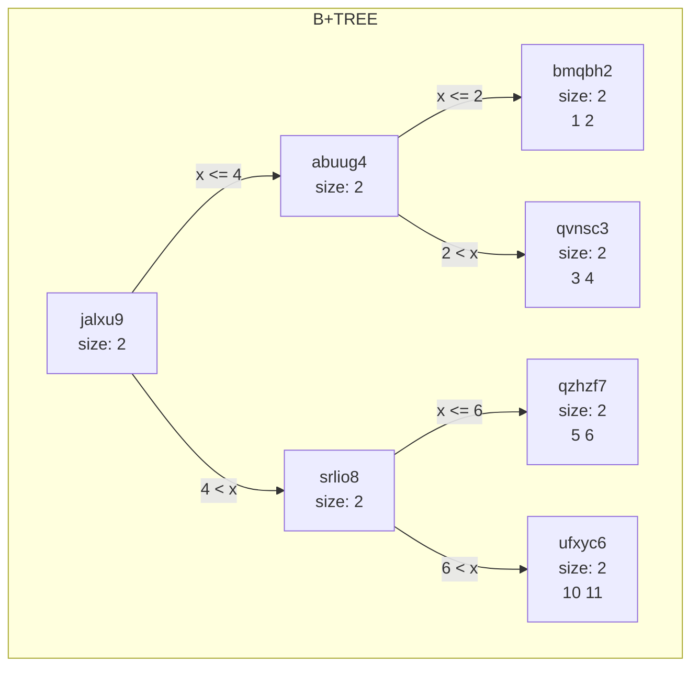
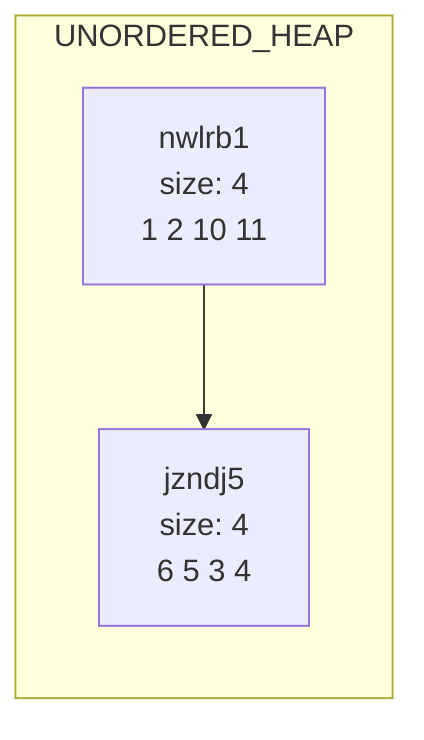

```mermaid
graph TD
subgraph B+TREE
jalxu9[jalxu9<br/>size: 2<br/>]
abuug4[abuug4<br/>size: 2<br/>]
bmqbh2[bmqbh2<br/>size: 2<br/>1 2 ]
abuug4-->|x <= 2|bmqbh2
qvnsc3[qvnsc3<br/>size: 2<br/>3 4 ]
abuug4-->|2 < x|qvnsc3
jalxu9-->|x <= 4|abuug4
srlio8[srlio8<br/>size: 2<br/>]
qzhzf7[qzhzf7<br/>size: 2<br/>5 6 ]
srlio8-->|x <= 6|qzhzf7
ufxyc6[ufxyc6<br/>size: 2<br/>10 11 ]
srlio8-->|6 < x|ufxyc6
jalxu9-->|4 < x|srlio8
end
```

```mermaid
graph LR
subgraph UNORDERED_HEAP
nwlrb1[nwlrb1<br/>size: 4<br/>1 2 10 11 ]
jzndj5[jzndj5<br/>size: 4<br/>6 5 3 4 ]
nwlrb1-->jzndj5
end
```
